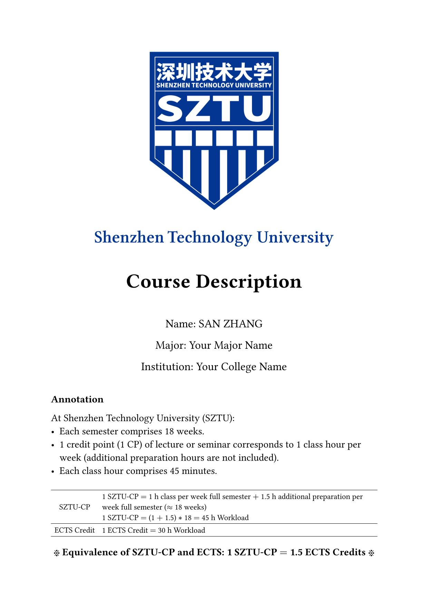
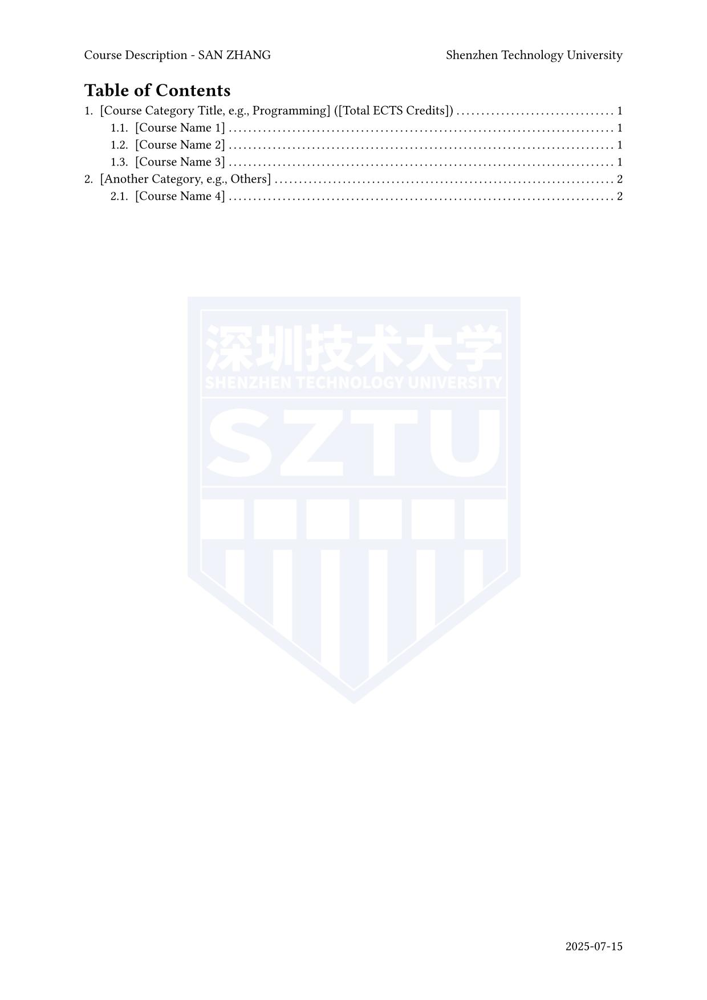
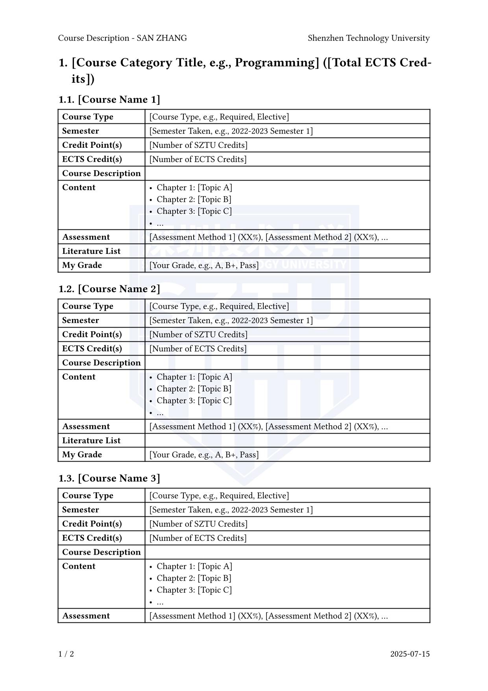
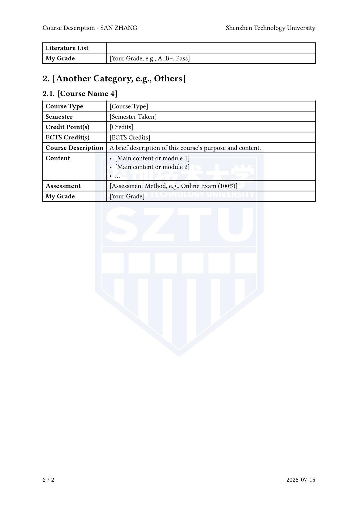

# SZTU Course Description Template

This template is based on the [typst-course-description-template](https://github.com/dsyislearning/typst-course-description-template) by [dsyislearning](https://github.com/dsyislearning). It has been modified to better suit the specific requirements of SZTU.

This repository contains a template for creating Course Description using [Typst](https://typst.app/). It is designed to assist in generating clear and professional course summaries, especially useful for students at Shenzhen Technology University (SZTU) who need to present course details in a standardized and visually appealing format when applying to universities.

## Preview

|  |  |
| ---------------------------------------------- | ---------------------------------------------- |
|  |  |

## Installation

To use this template, you need a local Typst environment. For a detailed Chinese tutorial on setting up the environment, please refer to this **[Zhihu article](https://zhuanlan.zhihu.com/p/644816041)**.

## Usage

In the `course_description.typ` file, you just need to fill in the information of your university, major, school, name, student ID, and the details of each course. The template will automatically generate a PDF file with the course descriptions.

### Metadata

Please begin your `course_description.typ` file with the following metadata:

```typst
# SZTU Course Description Template

This template is based on the [typst-course-description-template](https://github.com/dsyislearning/typst-course-description-template) by [dsyislearning](https://github.com/dsyislearning). It has been modified to better suit the specific requirements of Shenzhen Technology University (SZTU) and updated for compatibility with modern Typst versions.

This repository contains a template for creating a Course Description document using [Typst](https://typst.app/). It is designed to assist in generating clear and professional course summaries, especially useful for SZTU students who need to present course details in a standardized format when applying to universities.

## Preview

The appearance may vary slightly based on your content. It is recommended to update the preview images after generating your own document.

|  |  |
| ---------------------------------------------- | ---------------------------------------------- |
|  |  |

## Installation

To use this template, you need a local Typst environment. This template is compatible with **Typst v0.11.0 and newer**.

For a detailed Chinese tutorial on setting up the environment, please refer to this **[Zhihu article](https://zhuanlan.zhihu.com/p/644816041)**.

## Usage

You only need to edit the `main.typ` file. Fill in your personal information and the details for each course. The template will automatically generate a professional PDF document.

### Metadata

At the beginning of your `main.typ` file, configure your personal and document settings. **Remember to place your image assets (like logos) in the specified `image_path` directory.**

```typst
#import "template.typ": template, course

#show: template.with(
  // University Info (fixed for SZTU)
  university: "Shenzhen Technology University",
  
  // ----- Your Personal Information -----
  major: "[Your Major Name]",         // e.g., "Computer Science and Technology"
  school: "[Your College Name]",      // e.g., "College of Big Data and Internet"
  name: "[Your Name]",                // e.g., "LI Si"
  id: "[Your Student ID]",            // e.g., "2021XXXXXX"
  image_path: "images/",              // The folder where your images are stored
  
  // ----- Document Appearance -----
  // Cover image settings
  cover: (
    logo_path: "SZTU_logo.png",
    logo_width: 40%,
    logo_with_university_name: false,
  ),
  // Watermark settings for the document background
  watermark: (
    img_path: "SZTU_logo_translucent.png",
    img_width: 100mm,
  ),
)# SZTU Course Description Template

This template is based on the [typst-course-description-template](https://github.com/dsyislearning/typst-course-description-template) by [dsyislearning](https://github.com/dsyislearning). It has been modified to better suit the specific requirements of Shenzhen Technology University (SZTU) and updated for compatibility with modern Typst versions.

This repository contains a template for creating a Course Description document using [Typst](https://typst.app/). It is designed to assist in generating clear and professional course summaries, especially useful for SZTU students who need to present course details in a standardized format when applying to universities.

## Preview

The appearance may vary slightly based on your content. It is recommended to update the preview images after generating your own document.

|  |  |
| ---------------------------------------------- | ---------------------------------------------- |
|  |  |

## Installation

To use this template, you need a local Typst environment. This template is compatible with **Typst v0.11.0 and newer**.

For a detailed Chinese tutorial on setting up the environment, please refer to this **[Zhihu article](https://zhuanlan.zhihu.com/p/644816041)**.

## Usage

You only need to edit the `main.typ` file. Fill in your personal information and the details for each course. The template will automatically generate a professional PDF document.

### Metadata

At the beginning of your `main.typ` file, configure your personal and document settings. **Remember to place your image assets (like logos) in the specified `image_path` directory.**

```typst
#import "template.typ": template, course

#show: template.with(
  // University Info (fixed for SZTU)
  university: "Shenzhen Technology University",
  
  // ----- Your Personal Information -----
  major: "[Your Major Name]",         // e.g., "Computer Science and Technology"
  school: "[Your College Name]",      // e.g., "College of Big Data and Internet"
  name: "[Your Name]",                // e.g., "LI Si"
  id: "[Your Student ID]",            // e.g., "2021XXXXXX"
  image_path: "images/",              // The folder where your images are stored
  
  // ----- Document Appearance -----
  // Cover image settings
  cover: (
    logo_path: "SZTU_logo.png",
    logo_width: 40%,
    logo_with_university_name: false,
  ),
  // Watermark settings for the document background
  watermark: (
    img_path: "SZTU_logo_translucent_1.png",
    img_width: 100mm,
  ),
)
```

### Course Categories

Just use `= Course Category Name` to create a new category. For example, if you want to create a category named 'Major Courses', you can write

```typst

= Major Courses

#course(...)

#course(...)

```

### Course Description Items

The #course function formats the details for a single course. All parameters are named. If a field is not applicable (e.g., a course has no textbook), you can simply omit that parameter.
Here is a blank template for a single course:

```typst
#course(
  // --- Basic Information ---
  name: "[Course Name]",
  course_type: "[Course Type, e.g., Required, Elective]",
  semester: "[Semester Taken, e.g., 2022-2023 Semester 1]",
  credit: "[Number of SZTU Credits]",
  ECTS_credit: "[Number of ECTS Credits]",
  grade: "[Your Grade, e.g., A, B+, Pass]",
  
  // --- Detailed Descriptions ---
  description: [
    // Provide a comprehensive overview of the course.
    // What are the main goals? What key concepts are covered?
  ],
  content: [
    // List the main chapters, topics, or modules.
    - Chapter 1: [Topic A]
    - Chapter 2: [Topic B]
    - ...
  ],
  assessment: [
    // List the assessment methods and their respective weights.
    // Example: Attendance (10%), Homework (30%), Final Exam (60%).
  ],
  literature: [
    // List the required or recommended textbooks.
    // 1. "Book Title" by Author, Publisher, Year.
  ],
)

```
